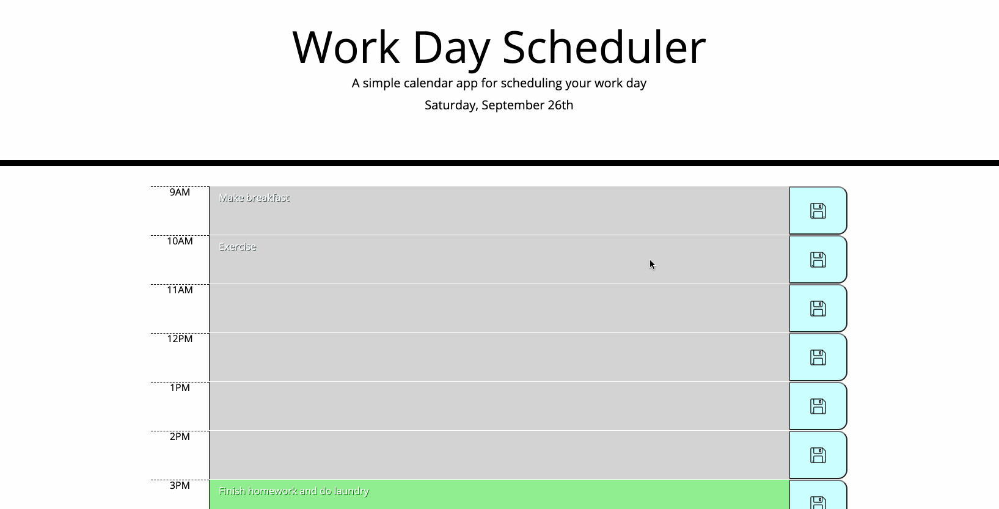
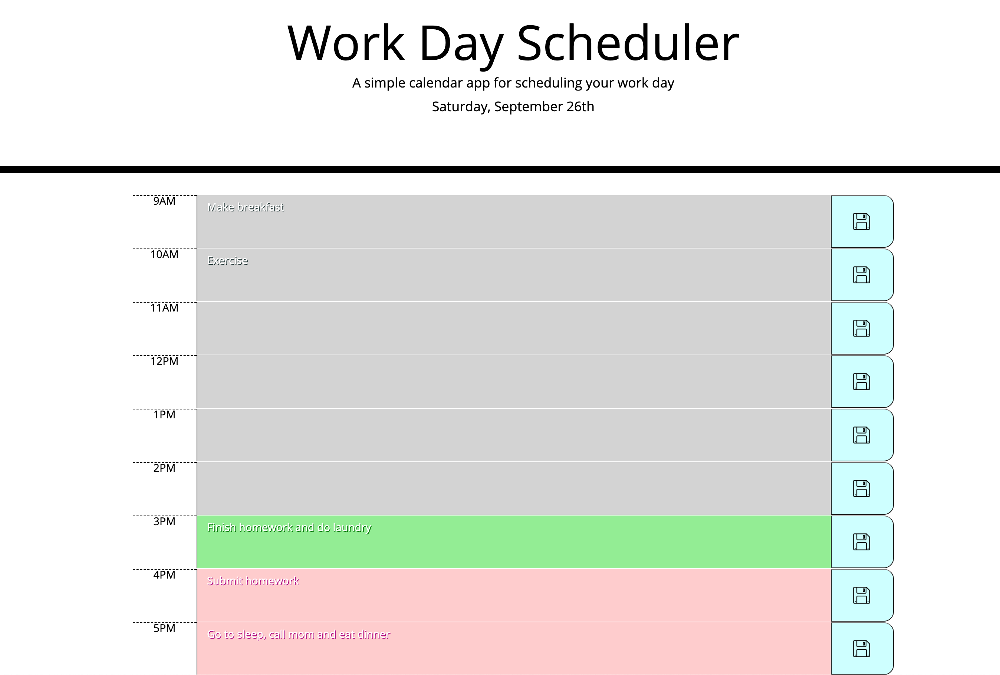

# Day Planner

In this project, I've created a simple application that lets the user plan their day from 9:00AM to 5:00PM. The user has a full and busy schedule and needed a way to exercise time management. The user wanted an application wherein he/she can save important events that displays the current day of the week and the date as well as the day planner to be up-to-date that recognizes the time of day, color coding each hour by graying out hours that have passed, highlights the current hour with a green color and colors in the rest of the future events to come with a pink shade. What makes this application great for the user is that even if the user refreshes the page, the saved events will still be there for the user.

This project was a good way to familiarize with the jQuery library. It has helped me understand how to use local storage and how we can incorporate real time using moment.js into the application. 

I did face some challenges as to not being all too familiar with jQuery just yet as I have come to use vanilla JavaScript more but I am confident that I will be able to work with it and understand with more practice and learning.

## Table of Contents

* [Features](#features)
* [Technologies Used](#technologies-used)
* [GIF of Project](#gif-of-project)
* [Image of Project](#images-of-project)
* [Code Snippet](#code-snippet)
* [Deployed Link](#deployed-link)
* [Authors](#authors)
* [License](#license)
* [Acknowledgments](#acknowledgments)

## Features

This project includes the following features:

* Today’s Date

    Displays the day of the week, the month and the day.

* Time Blocks

    This is where the user can input their events and utilize it as a to do list or whatever the user sees fit. It also works on real time wherein the colors of these time blocks will change depending on the time of day. Gray which means the time has passed, green which means it’s the current hour and pink which indicates the future hours.

* Save Button

    As mentioned earlier, the user can input text on the events of the day wherein whatever the user saves in the time blocks of any hour of the day, the saved data will persist even if the user decides to refresh the page. 


## Technologies Used

* [HTML](https://developer.mozilla.org/en-US/docs/Web/HTML)
* [CSS](https://developer.mozilla.org/en-US/docs/Web/CSS)
* [Bootstrap](https://getbootstrap.com/)
* [Javascript](https://developer.mozilla.org/en-US/docs/Web/JavaScript)
* [jQuery](https://jquery.com/)

## GIF of Project




## Image of Project

Attached below is a picture of the application.



## Code Snippet

In this code snippet, this is the for loop that color codes the text boxes with the respective time of the day. 

```
// military time for the color blocks and converted into a number
var hourofDay = +moment().format('H');

// loop through the time of day to change colors of textarea
for (var i = 0; i < textBox.length; i++) {

    // storing data-value attribute into variable and converting to a number
    var everyHr = +($("textarea").eq(i)).attr("data-value");

    // for past hour: gray text box; present hour: green text box; future hour: pink text box
    if (hourofDay == everyHr) {
        $("textarea").eq(i).addClass("present");
    }
    else if (everyHr > hourofDay) {
        $("textarea").eq(i).addClass("future");
    }
    else {
        $("textarea").eq(i).addClass("past");
    }
};
```

## Deployed Link

* [See Live Site](https://janessaref.github.io/plan-your-day/)


## Authors

* Janessa Reeanne Fong

- [Link to Github](https://github.com/janessaref)
- [Link to LinkedIn](https://www.linkedin.com/in/janessafong)

## License

This project is licensed under the MIT License 

## Acknowledgments

* I'd like to acknowledge my tutor Andrew Knapp for helping me get unstuck with local storage which was my challenge for this project.
* I'd like to also acknowledge my instructors and TAs, Roger Lee, Kerwin Hy and Manuel Nunes.

